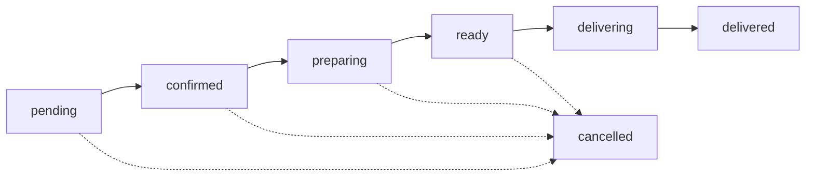

# 🍽️ نظام إدارة الطلبات - Food CMS Dashboard

<div align="center">


**نظام متكامل لإدارة طلبات المطاعم في لوحة التحكم**

[البدء السريع](#-البدء-السريع) •
[الميزات](#-الميزات) •
[التوثيق](#-التوثيق) •
[الدعم](#-الدعم)

</div>

---

## 📋 جدول المحتويات

- [نظرة عامة](#-نظرة-عامة)
- [البدء السريع](#-البدء-السريع)
- [الميزات](#-الميزات)
- [بنية المشروع](#-بنية-المشروع)
- [التوثيق](#-التوثيق)
- [لقطات الشاشة](#-لقطات-الشاشة)
- [التقنيات المستخدمة](#-التقنيات-المستخدمة)
- [المساهمة](#-المساهمة)
- [الدعم](#-الدعم)

---

## 🎯 نظرة عامة

نظام شامل لإدارة طلبات المطاعم مصمم خصيصاً للوحة التحكم (Dashboard). يتيح النظام:

- 📊 عرض وإدارة جميع الطلبات
- 🔄 تتبع حالة كل طلب
- 📈 إحصائيات شاملة في الوقت الفعلي
- 🔍 تصفية متقدمة للطلبات
- 📱 تصميم متجاوب لجميع الأجهزة
- 🌙 دعم الوضع الداكن

---

## 🚀 البدء السريع

### المتطلبات

- Node.js 18.0.0+
- npm 9.0.0+
- حساب Supabase

### التثبيت

```bash
# 1. استنساخ المشروع
git clone [repository-url]

# 2. الانتقال لمجلد Dashboard
cd dashbored

# 3. تثبيت التبعيات
npm install

# 4. إعداد متغيرات البيئة
cp .env.example .env.local
# عدّل الملف بمعلومات Supabase الخاصة بك

# 5. تنفيذ SQL في Supabase
# افتح Supabase Dashboard → SQL Editor
# نفذ محتويات: ../app/supabase_orders_table.sql

# 6. تشغيل المشروع
npm run dev
```

### الوصول

افتح المتصفح على: **http://localhost:3000**

---

## ✨ الميزات

### 1. لوحة التحكم الرئيسية

- 📊 **8 بطاقات إحصائية** تعرض:
  - إجمالي الطلبات
  - الطلبات حسب الحالة
  - إجمالي الإيرادات
  - متوسط قيمة الطلب
  - توزيع أنواع الطلبات

### 2. إدارة الطلبات

- ✅ عرض قائمة شاملة لجميع الطلبات
- 🔄 تحديث حالة الطلب مباشرة
- 📝 إضافة وتعديل ملاحظات
- 🔍 عرض تفاصيل كاملة لكل طلب

### 3. نظام التصفية المتقدم

- 🎯 تصفية حسب الحالة (7 حالات مختلفة)
- 📦 تصفية حسب نوع الطلب (توصيل/استلام)
- 🏪 تصفية حسب الفرع
- 📅 تصفية حسب التاريخ (من - إلى)

### 4. تفاصيل الطلب

- 📦 قائمة المنتجات المطلوبة
- 📍 عنوان التوصيل الكامل
- 💰 تفاصيل الأسعار
- 📝 ملاحظات الطلب
- 👤 معلومات العميل

### 5. واجهة المستخدم

- 📱 تصميم متجاوب 100%
- 🌙 دعم الوضع الداكن
- 🎨 ألوان وأيقونات واضحة
- ⚡ سرعة عالية وأداء ممتاز
- 🔔 إشعارات Toast للعمليات

---

## 📁 بنية المشروع

```
dashbored/
│
├── services/
│   └── apiOrders.ts              # API calls للطلبات
│
├── src/
│   ├── app/
│   │   └── (protected)/
│   │       └── dashboard/
│   │           └── orders/
│   │               ├── page.tsx         # قائمة الطلبات
│   │               └── [id]/
│   │                   └── page.tsx     # تفاصيل الطلب
│   │
│   └── components/
│       └── Orders/
│           ├── OrdersStats.tsx          # الإحصائيات
│           ├── OrdersFilters.tsx        # الفلاتر
│           ├── OrdersTable.tsx          # الجدول
│           └── index.ts                 # exports
│
└── [Documentation]/
    ├── ORDERS_SYSTEM_README.md          # توثيق شامل
    ├── ORDERS_QUICK_START.md            # دليل البدء السريع
    ├── ORDERS_SYSTEM_CHANGES.md         # التغييرات
    ├── FILES_SUMMARY.md                 # ملخص الملفات
    └── RUN_COMMANDS.md                  # أوامر التشغيل
```

---

## 📚 التوثيق

### الملفات المرجعية

| الملف                                                    | الوصف                       | للمن؟               |
| -------------------------------------------------------- | --------------------------- | ------------------- |
| [`ORDERS_QUICK_START.md`](./ORDERS_QUICK_START.md)       | دليل البدء السريع (5 دقائق) | 🆕 المبتدئين        |
| [`ORDERS_SYSTEM_README.md`](./ORDERS_SYSTEM_README.md)   | التوثيق الشامل والتفصيلي    | 📖 الجميع           |
| [`ORDERS_SYSTEM_CHANGES.md`](./ORDERS_SYSTEM_CHANGES.md) | ملخص التغييرات والميزات     | 🔧 المطورين         |
| [`FILES_SUMMARY.md`](./FILES_SUMMARY.md)                 | ملخص الملفات والإحصائيات    | 📊 Project Managers |
| [`RUN_COMMANDS.md`](./RUN_COMMANDS.md)                   | أوامر التشغيل والتطوير      | 💻 المطورين         |

### روابط سريعة

- 🚀 [البدء خلال 5 دقائق](./ORDERS_QUICK_START.md)
- 📖 [التوثيق الكامل](./ORDERS_SYSTEM_README.md)
- 🔧 [دليل التطوير](./ORDERS_SYSTEM_CHANGES.md)
- 💻 [أوامر التشغيل](./RUN_COMMANDS.md)

---

## 🖼️ لقطات الشاشة

### قائمة الطلبات

```
┌─────────────────────────────────────────────────────────┐
│  📊 الإحصائيات (8 بطاقات)                             │
├─────────────────────────────────────────────────────────┤
│  🔍 الفلاتر (حالة، نوع، فرع، تاريخ)                   │
├─────────────────────────────────────────────────────────┤
│  📋 جدول الطلبات مع إمكانية التعديل                   │
└─────────────────────────────────────────────────────────┘
```

### تفاصيل الطلب

```
┌────────────────────────┬──────────────────────────────┐
│  📦 المنتجات          │  🔄 تحديث الحالة            │
│  💰 تفاصيل الأسعار    │  ℹ️ معلومات الطلب           │
│  📝 الملاحظات         │  📍 عنوان التوصيل           │
└────────────────────────┴──────────────────────────────┘
```

---

## 🛠️ التقنيات المستخدمة

### Frontend

- **React** 18 - مكتبة UI
- **Next.js** 14 - إطار العمل
- **TypeScript** - لغة البرمجة
- **Tailwind CSS** - التنسيقات

### Backend/Database

- **Supabase** - Backend as a Service
- **PostgreSQL** - قاعدة البيانات
- **Row Level Security** - الأمان

### UI/UX

- **Material Symbols** - الأيقونات
- **Remix Icons** - أيقونات إضافية
- **React Hot Toast** - الإشعارات
- **Responsive Design** - متوافق مع الجوال

---

## 🎓 دليل الاستخدام

### 1. عرض الطلبات

```
القائمة الجانبية → الطلبات → قائمة الطلبات
```

### 2. تصفية الطلبات

```
استخدم قسم "تصفية الطلبات" في أعلى الصفحة
→ اختر المعايير المطلوبة
→ النتائج تتحدث تلقائياً
```

### 3. تحديث حالة الطلب

```
الطريقة الأولى: من الجدول
→ عمود "تغيير الحالة" → اختر الحالة الجديدة

الطريقة الثانية: من صفحة التفاصيل
→ "عرض التفاصيل" → قائمة "تحديث الحالة"
```

### 4. عرض التفاصيل

```
من جدول الطلبات
→ اضغط "عرض التفاصيل"
→ ستظهر جميع المعلومات الكاملة
```

### 5. إضافة ملاحظات

```
صفحة التفاصيل
→ قسم "ملاحظات الطلب"
→ اكتب الملاحظات
→ "تحديث الملاحظات"
```

---

## 🔄 حالات الطلب



| الحالة       | العربية      | الوصف                  |
| ------------ | ------------ | ---------------------- |
| `pending`    | قيد الانتظار | طلب جديد ينتظر التأكيد |
| `confirmed`  | مؤكد         | تم تأكيد الطلب         |
| `preparing`  | قيد التحضير  | جاري تحضير الطلب       |
| `ready`      | جاهز         | الطلب جاهز للتسليم     |
| `delivering` | قيد التوصيل  | جاري توصيل الطلب       |
| `delivered`  | تم التوصيل   | تم التوصيل بنجاح       |
| `cancelled`  | ملغى         | تم إلغاء الطلب         |

---

## 🤝 المساهمة

نرحب بمساهماتكم! إذا كنت ترغب في المساهمة:

1. Fork المشروع
2. أنشئ branch جديد (`git checkout -b feature/AmazingFeature`)
3. Commit التغييرات (`git commit -m 'Add some AmazingFeature'`)
4. Push إلى Branch (`git push origin feature/AmazingFeature`)
5. افتح Pull Request

---

## 🐛 الإبلاغ عن المشاكل

إذا واجهت أي مشاكل:

1. تحقق من [المشاكل الشائعة](./ORDERS_QUICK_START.md#المشاكل-الشائعة-وحلولها)
2. ابحث في [Issues](../../issues)
3. إذا لم تجد حل، افتح Issue جديد

---

## 📞 الدعم

### الوثائق

- 📖 [التوثيق الشامل](./ORDERS_SYSTEM_README.md)
- 🚀 [دليل البدء السريع](./ORDERS_QUICK_START.md)
- 💻 [أوامر التشغيل](./RUN_COMMANDS.md)

### التواصل

- 📧 البريد الإلكتروني: support@example.com
- 💬 Discord: [انضم للسيرفر](#)
- 🐛 المشاكل: [GitHub Issues](../../issues)

---

## 📊 الإحصائيات

- **الملفات المضافة:** 10
- **الملفات المعدلة:** 2
- **أسطر الكود:** ~1,311
- **المكونات:** 3
- **الصفحات:** 2
- **API Methods:** 7

---

## 📝 الترخيص

هذا المشروع مرخص بموجب رخصة MIT - انظر ملف [LICENSE](./LICENSE) للتفاصيل.

---

## 🎉 الشكر والتقدير

شكراً لكل من ساهم في تطوير هذا النظام!

---

<div align="center">

**🍽️ Food CMS - Orders Management System**

Made with ❤️ by the Development Team

[⬆ العودة للأعلى](#-نظام-إدارة-الطلبات---food-cms-dashboard)

</div>
